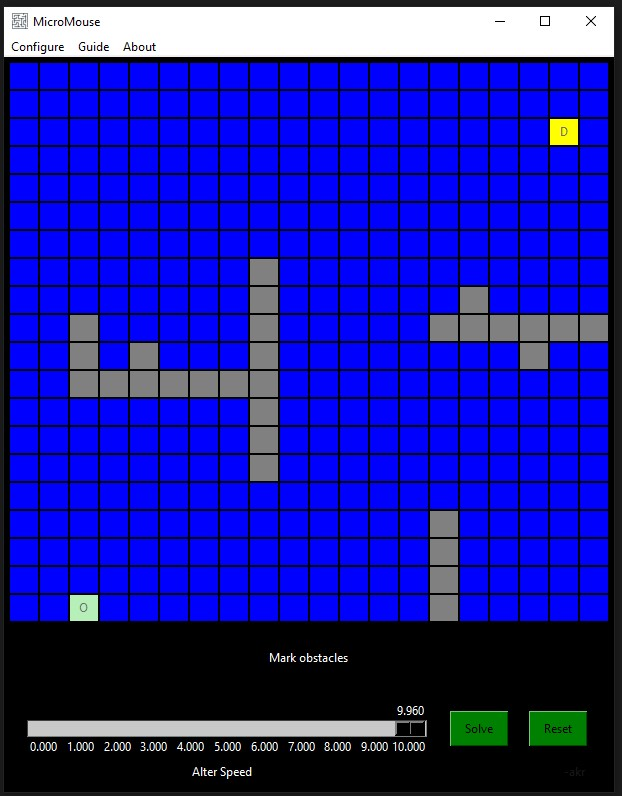

# MicroMouse
MicroMouse Game (PathFinding Game)

## Introduction
This project is about creating a MicroMouse Game with simple to use GUI.

## Video
https://drive.google.com/file/d/1aI0WEkwxIdCPi7pKr5IukfNpJ6gDtTgy/view?usp=sharing

## Getting started
In order to run this script, you need to have Python and pip installed on your system. After you're done installing Python and pip, run the following command from your terminal to install the requirements from the same folder (directory) of the project.
```
pip install -r requirements.txt
```

After satisfying all the requirements for the project, Open the terminal in the project folder and run
```
python micromouse.py
```
or
```
python3 micromouse.py
```
depending upon the python version. Make sure that you are running the command from the same virtual environment in which the required modules are installed.





### Standalone Executable (ONLY for windows users)
<a href="https://drive.google.com/drive/folders/1NW1BxdMUNbE-jI28QPzg1sI3Wcufa84m?usp=sharing">Get executable</a>
